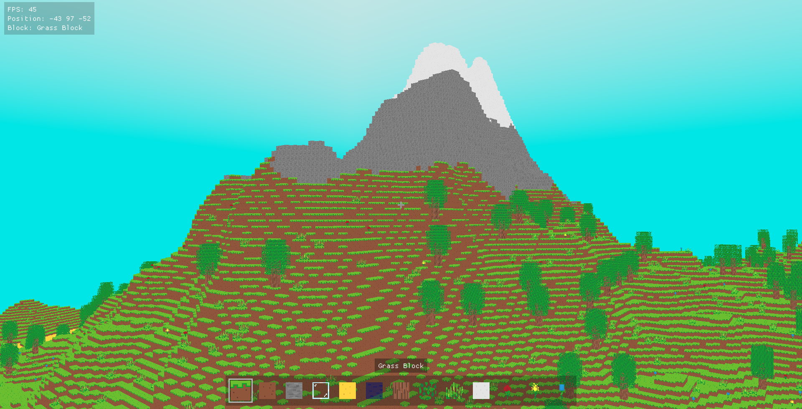
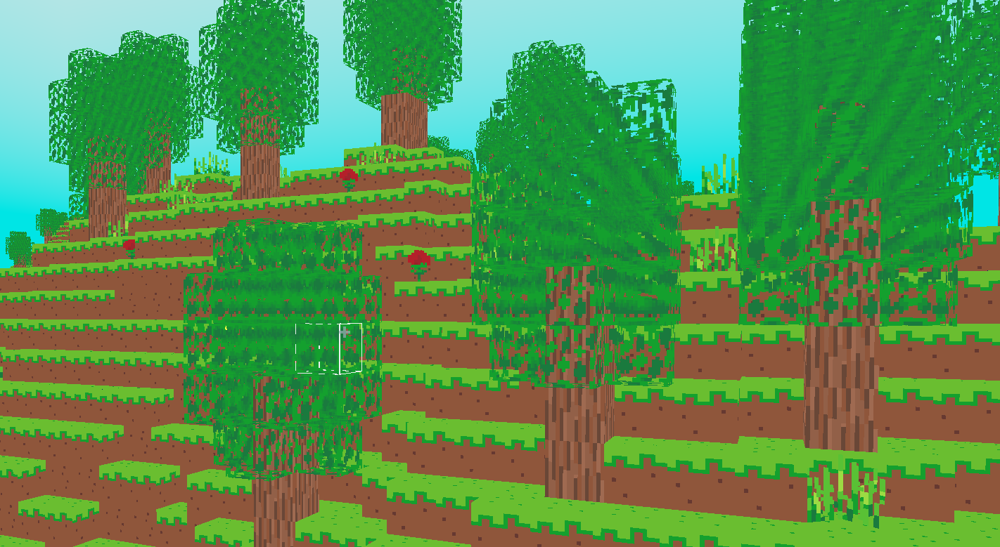
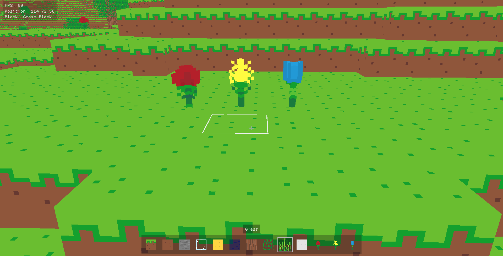
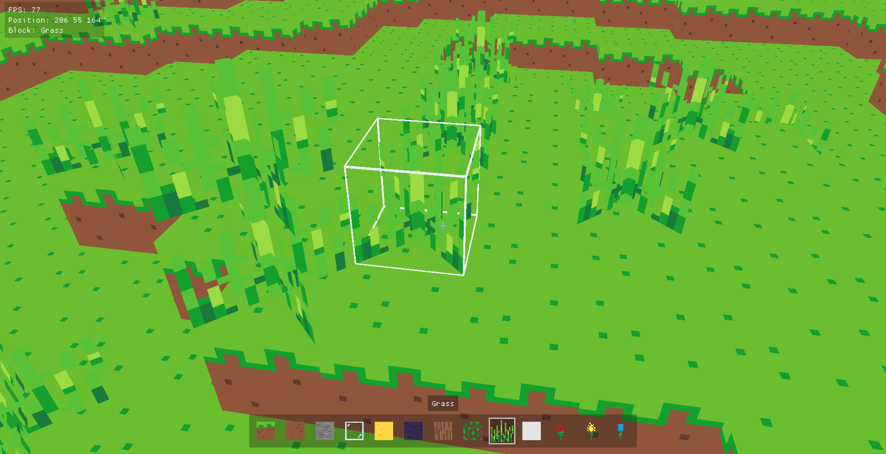
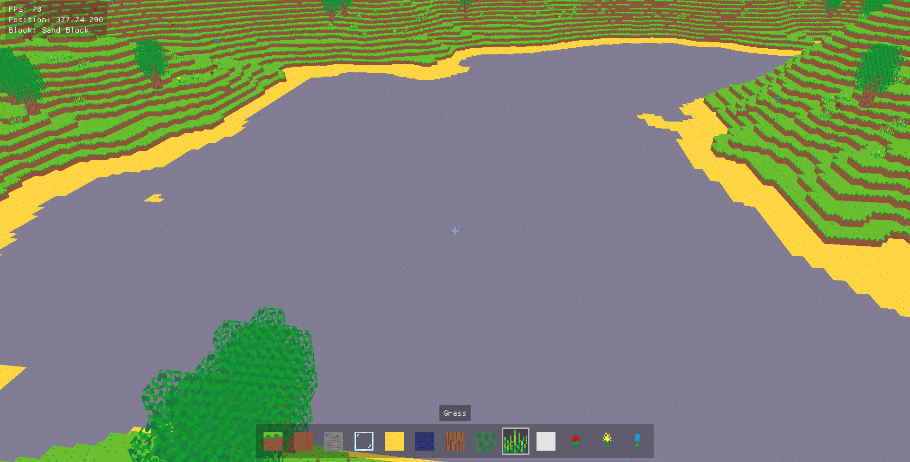
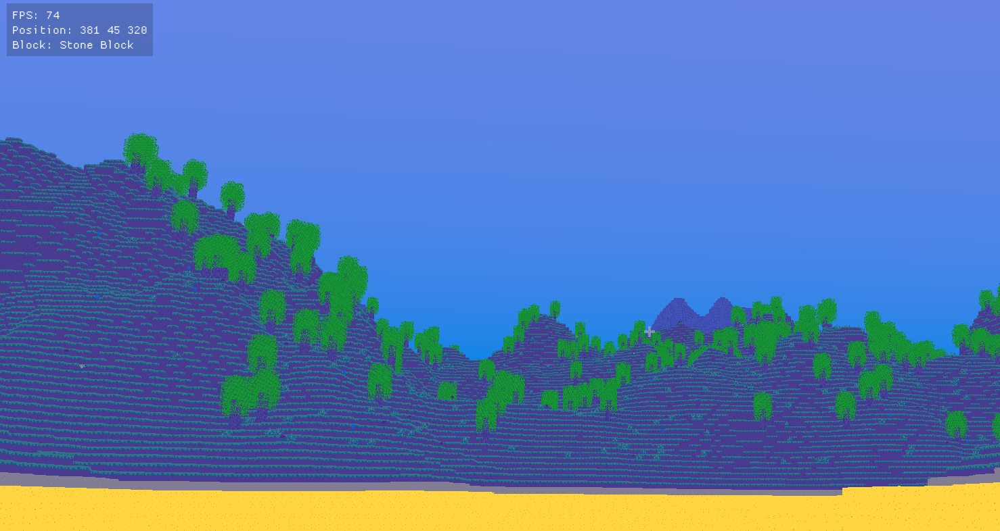
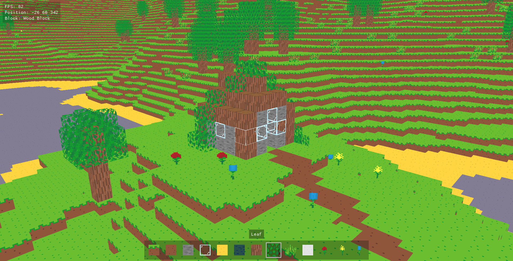
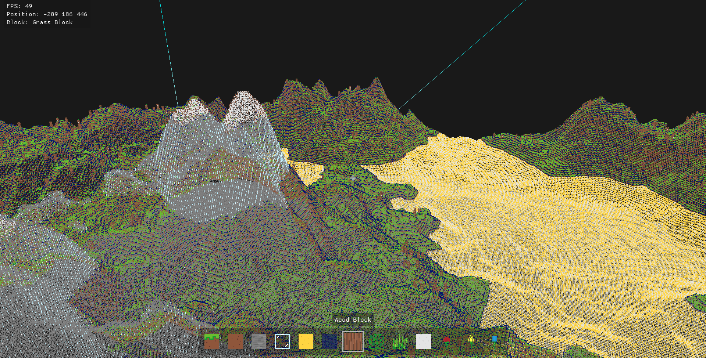
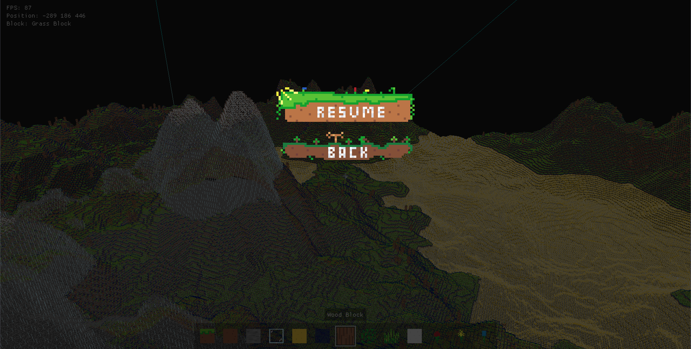

    
    <h1 align="center">YourCraft</h1>
    
<i>❝ It's not <strike>Mine</strike>, but <b>Your . . . Craft ! ❞ — @qninhdt</b></i>

---

## 💡 Features
- Infinite, procedurally generated world
- Full transparency + translucency support
- Debug widget
- Inventory GUI

## 🎮 How to play
- `Left Click` to break a block
- `Right Click` to place a block
- `WASD` to move around
- `Space` to go up
- `Shift` to go down
- `Esc` to pause game

## 🖼️ Preview

- ### Mountain

- ### Tree

- ### Flower

- ### Grass

- ### Snow

- ### Water

- ### Glass

- ### Simple house

- ### Debug mode

- ### Pause menu

---

## 📁 Folder structure

    ├── deps                # Libraries (glad, glm, ...) 
    ├── images              # Development process 
    ├── resources           # Game texture and shader files
    └── src                 # Source files
    |   ├── gl                  # OpenGL wrapper
    |   ├── graphic             # Game rendering (mesh, framebuffer, ...)
    |   ├── gui                 # Game user interface
    |   ├── util                # Utility functions
    |   ├── world               # Manage world components (chunk, tree, ...)
    |   └── ...
    └── ...

## 📦 Libraries
- [glad](https://github.com/Dav1dde/glad) - Loading OpenGL functions
- [GLFW](https://github.com/glfw/glfw) - Creating window and reading input 
- [glm](https://github.com/g-truc/glm) - Math calculating
- [FastNoiseLite](https://github.com/Auburn/FastNoiseLite) - Used in terrain generation
- [imgui](https://github.com/ocornut/imgui) - For creating an awesome GUI
- [stb_image.h](https://github.com/nothings/stb/blob/master/stb_image.h) - Loading PNG textures

## 🔨 Tools
- [Visual Studio Code](https://code.visualstudio.com/)
- [CMake](https://cmake.org/) - For building C++ project
- [Aseprite](https://www.aseprite.org/) - For game textures

## 🌟 References
- https://learnopengl.com/
- https://github.com/Isti01/glCraft
- https://github.com/Hopson97/HopsonCraft

## 🔒 License
[YourCraft License](./LICENSE.md)
